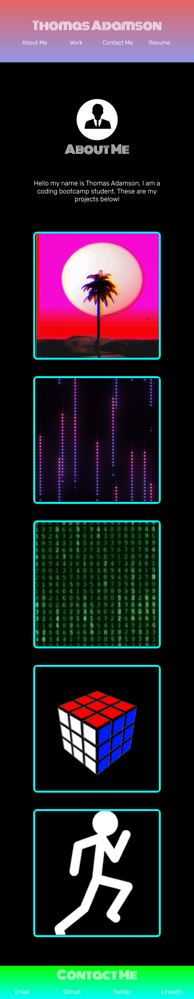

# Project-Portfolio

## Description

This project will be used as a portfolio website for projects that I will create. Currently the functionality is mostly just placeholders, but has responsive behaviour
and showcases my current expertise in CSS and HTML.

## Installation

N/A

## Usage

To view the completed website, please visit [https://taada33.github.io/Project-Portfolio/](https://taada33.github.io/Project-Portfolio/)

## Credits

Assets used:

[https://www.pngitem.com/pimgs/m/10-106042_male-professional-avatar-icon-hd-png-download.png](https://www.pngitem.com/pimgs/m/10-106042_male-professional-avatar-icon-hd-png-download.png)
[https://thumbs.gfycat.com/BeneficialDentalGosling.webp](https://thumbs.gfycat.com/BeneficialDentalGosling.webp)
[https://media3.giphy.com/media/8lGQNlZqYBP86D4Cep/giphy.gif?cid=790b7611410df1f5877483bd96b6250d12044b3ababd9118&rid=giphy.gif&ct=g](https://media3.giphy.com/media/8lGQNlZqYBP86D4Cep/giphy.gif?cid=790b7611410df1f5877483bd96b6250d12044b3ababd9118&rid=giphy.gif&ct=g)
[https://media1.giphy.com/media/quEsMOrr3hmQ8/giphy.gif?cid=790b7611348426cf2283cbc8ff2f83f5ca7669e8a9df7421&rid=giphy.gif&ct=g](https://media1.giphy.com/media/quEsMOrr3hmQ8/giphy.gif?cid=790b7611348426cf2283cbc8ff2f83f5ca7669e8a9df7421&rid=giphy.gif&ct=g)
[https://media.tenor.com/VGowjXpojsYAAAAM/rubiks-cube-gif.gif](https://media.tenor.com/VGowjXpojsYAAAAM/rubiks-cube-gif.gif)
[https://media.tenor.com/Pvf58wBw6aAAAAAM/stickman-running.gif](https://media.tenor.com/Pvf58wBw6aAAAAAM/stickman-running.gif)

Rubik and Monoton fonts imported from [https://fonts.google.com/](https://fonts.google.com/)

## License
Copyright <2022> <Thomas Adamson>

Permission is hereby granted, free of charge, to any person obtaining a copy of this software and associated documentation files (the "Software"), to deal in the Software without restriction, including without limitation the rights to use, copy, modify, merge, publish, distribute, sublicense, and/or sell copies of the Software, and to permit persons to whom the Software is furnished to do so, subject to the following conditions:

The above copyright notice and this permission notice shall be included in all copies or substantial portions of the Software.

THE SOFTWARE IS PROVIDED "AS IS", WITHOUT WARRANTY OF ANY KIND, EXPRESS OR IMPLIED, INCLUDING BUT NOT LIMITED TO THE WARRANTIES OF MERCHANTABILITY, FITNESS FOR A PARTICULAR PURPOSE AND NONINFRINGEMENT. IN NO EVENT SHALL THE AUTHORS OR COPYRIGHT HOLDERS BE LIABLE FOR ANY CLAIM, DAMAGES OR OTHER LIABILITY, WHETHER IN AN ACTION OF CONTRACT, TORT OR OTHERWISE, ARISING FROM, OUT OF OR IN CONNECTION WITH THE SOFTWARE OR THE USE OR OTHER DEALINGS IN THE SOFTWARE.
